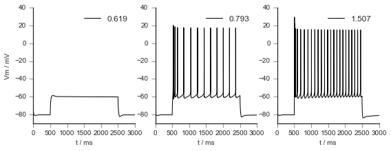

<div align="center">


# The In-Silico-Framework (ISF)
[](https://github.com/research-center-caesar/in_silico_framework/actions/workflows/test-isf-py27.yml)
[](https://github.com/research-center-caesar/in_silico_framework/actions/workflows/test-isf-py3.yml)</div>

## Installation

Every student needs to be able to synchronize their repository with https://github.com/research-center-caesar/in_silico_framework. Detailed instructions on how to install the repo are given in the [installer directory](./installer/).


## Usage

The [Interface module](./Interface.py) glues together all submodules and gives direct access to them. Rather than importing individual submodules, it is recommended to access them via Interface. Most of your code will probably start with
```python
import Interface as I
```

A walkthrough of the capabilities of ISF is presented in the ["Getting Started" notebook](./getting_started/getting_started.ipynb). Core functionalities are repeated below.

### Model DataBase (mdb)

A model database is on-disk storage whose syntax is mimicking a dictionary in python. Data in an mdb can be saved with various formats (use `I.dumper_ autocomplete`). The format needs to be specified while saving the data, but not for loading the data. This allows to change (optimize) the format without the need to update code operating on it. A mdb has been designed to contain and give convenient access to data from large scale simulations, which do not fit in memory. Access to a modeldatabase is done with the [mdb module](./model_data_base). Some MDB's need to be registered to resolve hashed paths to absolute paths before you can navigate them.
```python
import Interface as I
I.ModelDataBase # main class of model_data_base
I.mdb_init_simrun_general.init # default method to initialize a model data base with existing simulation results
I.mdb_init_simrun_general.optimize # converts the data to speed optimized compressed binary format

# Initialising a MDB in Python
mdb = I.ModelDataBase('<path to simulation directory>')
mdb._register_this_database()
sim_mdb = mdb['mdbs']['<path to specific simulation in directory>']
sim_mdb._register_this_database()
```
	
### Simulating

Running a simulation requires 3 things to be defined
1. A neuron morphology (hoc-morphology)
2. A biophysical description of the neuron, i.e. the ion-channel distribution (parameter file)
3. Some input (current injection, synaptic input ...)

Usually, launching biophysically detailed simulations is done with the [simrun2](./simrun2/) or [simrun3](./simrun3/) module. These provide **high-level acces** to define parameters and run simulations.

When you would like more direct and **low-level access** to the simulations, you can do so by parsing a parameter file (`.param` file) with [Single Cell Parser (scp)](./single_cell_parser/). This parameter file is read in as a nested dictionary that contains the biophysical parameters and the filename of a morphology file (`.hoc` file).

Defining a cell can be done as such:
```python
import Interface as I
parameter_file = I.os.path.join("<filename>.param")
cell_parameters = I.scp.build_parameters(parameter_file) # this is the main method to load in parameterfiles
# Use single_cell_parser module to create a cell from parameters
cell = I.scp.create_cell(cell_parameters.neuron)
```

If we now define a injection site, injection amplitude, and a recording site, we have everything we need for a classic current injection experiment.
```python
import neuron
h = neuron.h  # NEURON's python API
# let's define a pipette at the some
iclamp = h.IClamp(0.5, sec=cell.soma)
iclamp.delay = 150 # give the cell 150 ms to reach steady state
iclamp.dur = 5 # duration: 5ms rectangular pulse
amplitudes = [0.619, 0.793, 1.507] # amplitudes in nA
for amp in amplitudes:
	iclamp.amp = amp  # set the amplitude
	I.scp.init_neuron_run(cell_parameters.sim)  # run the simulation
```
	


ISF allows for way more complex simulations by embedding in-vivo recorded anatomies into an in-silico model of the barrel cortex, and simulating synaptic activity, rather than performing current injections. We recommend the reader to visit [Getting Started](./getting_started/getting_started.ipynb) for more info.
