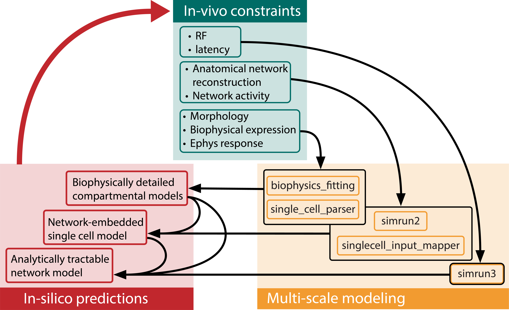

.. In-Silico Framework (ISF) documentation master file, created by
   sphinx-quickstart on Wed Mar 22 13:27:10 2023.
   You can adapt this file completely to your liking, but it should at least
   contain the root `toctree` directive.

The In-Silico Framework (ISF)
=====================================================

ISF is a multi-scale simulation environment for the generation, simulation, and analysis of neurobiologically tractable single cell and network-level simulations.

.. raw:: html
   <!DOCTYPE html>
   <head>
      <link rel="stylesheet" type="text/css" href="default.css">
   </head>

   

      
Input

      
In-vivo observation

   

   

      
ISF

      

      <button type="button" class="collapsible" id="neuron-button">Neuron model</button>
      

         
Lorem ipsum...

      

      

      <button type="button" class="collapsible" >Multi-scale model</button>
      

         
Lorem ipsum...

      
 

      

      <button type="button" class="collapsible" >Network model</button>
      

         
Lorem ipsum...

      
 

   

   

      
Output

      
Mechanistic explanation

   

   

Module list
=============

.. autosummary::
   :toctree: _autosummary
   :recursive:

   Interface
   barrel_cortex
   biophysics_fitting
   data_base
   simrun2
   simrun3
   single_cell_parser
   singlecell_input_mapper
   spike_analysis
   visualize

Tutorials
=============
.. nbgallery::
   :caption: Introduction
   :glob:

   Introduction_to_ISF.ipynb

.. nbgallery::
   :caption: 1. Neuron models
   :glob:

   tutorials/1. neuron models/*

.. nbgallery::
   :caption: 2. Network models
   :glob:

   tutorials/2. network models/*

.. nbgallery::
   :caption: 3. Multiscale models
   :glob:

   tutorials/2. network models/*

.. nbgallery::
   :caption: 4. Analytically tractable reduced models
   :glob:

   tutorials/4. reduced models/*

.. nbgallery::
   :caption: 5. Analysis
   :glob:

   tutorials/5. analysis/*

Indices and tables
==================

* :ref:`genindex`
* :ref:`modindex`
* :ref:`search`